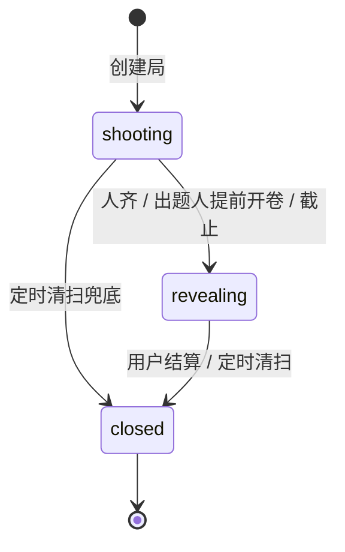

# 架构说明

## 1. 设计目标

「人间命题」面向小型熟人局，优先级依次为：

1. 微信群分享后能稳定加入和交卷。
2. 不依赖实时长连接，断网重试不产生重复数据。
3. 揭晓前严格匿名，结算后完整回填作者和卧底信息。
4. 云端 AI 不可用时，核心玩法仍能完成。
5. 前端可以在零云环境下完整演示和自动化测试。

## 2. 分层结构

```text
┌──────────────────────────────────────────────┐
│ pages / components                            │
│ 页面展示与交互，不包含云数据库访问            │
└──────────────────────┬───────────────────────┘
                       │
┌──────────────────────▼───────────────────────┐
│ src/api/index.js                              │
│ 统一方法、数据模型、错误语义、演示模式标识    │
└───────────────┬──────────────────┬───────────┘
                │                  │
┌───────────────▼────────┐  ┌──────▼─────────────────────┐
│ src/api/mock.js         │  │ src/api/cloud.js            │
│ storage + NPC 行为      │  │ 云函数调用 + 文件上传       │
└────────────────────────┘  └──────┬─────────────────────┘
                                    │ action / payload
                         ┌──────────▼─────────────────────┐
                         │ cloudfunctions/main/index.js   │
                         │ 鉴权与 action 路由              │
                         └──────────┬─────────────────────┘
                                    │
       ┌────────────────────────────┼────────────────────────────┐
       │                            │                            │
┌──────▼───────┐           ┌────────▼────────┐          ┌────────▼────────┐
│ game.js      │           │ ai.js           │          │ admin.js         │
│ 状态机/数据  │           │ 出题/裁判/点评  │          │ 题库种子         │
└──────┬───────┘           └────────┬────────┘          └─────────────────┘
       │                            │
┌──────▼────────────────────────────▼──────────────────────────────────────┐
│ 云数据库 / 云存储 / 微信内容安全 / 订阅消息 / OpenAI 兼容模型            │
└──────────────────────────────────────────────────────────────────────────┘
```

`cloudfunctions/timer` 不承载业务逻辑，只负责手动调用 `main` 的 `timer.sweep`。正式清扫由 `main/config.json` 的定时触发器每 5 分钟运行。

## 3. 回合状态机



约束：

- `shooting` 只允许局内玩家交卷，且每人的有效交卷只有一份。
- 只有局主可以提前开卷；通常还要求所有人已交卷。
- 进入 `revealing` 后发放匿名墙，允许猜人和三类投票。
- `closed` 由幂等结算写入，奖项、点评、出题权和明日预告只生成一次。
- 截止后仍处于 `shooting` 的局，会先被定时任务（或结算动作自己）推进到 `revealing`（补上阅卷期），
  只有在 `revealing` 停留超过「截止时间 + 阅卷窗口（24 小时）」后才结算为 `closed`；
  局主可以随时提前收卷。直接把过期的 `shooting` 局结算掉会让常见的「人不齐」局以三个空奖项收场。
- `shooting → closed` 这条边**不存在**。所有进入 `closed` 的局都必须经过 `revealing`。

## 4. 请求与业务流

### 创建、入局和交卷

1. `round.create` 在云函数中生成局编号、命题、模式、截止时间，并把**局主**写入 `players`。
2. 局主把小程序卡片分享到群；受邀者点开后进入局内页。
3. 局内页拿到 `RoundDetail.isPlayer === false`（受邀但还没入局）时会调用 `round.join`，
   把自己写进 `players`。这一步是幂等的，已开卷或已截止则拒绝。
   **没有 `round.join`，`players` 永远只有局主一人，除局主外没人能交卷，人齐自动开卷也不会触发。**
4. 图片先上传云存储，`entry.submit` 只接收 `cloud://` fileID。
5. 云函数执行文本安全检查（判定违规即拒绝），并尽力调用视觉模型判断是否跑题。
6. 当前玩家标记已交卷；若人齐则进入 `revealing`，按人数决定是否混入卧底，并发出卷订阅消息。
7. 连击在交卷成功后更新，AI 判定失败不会阻断交卷。

### 揭晓和投票

1. `wall.get` 只返回未判定为 `off` 的答卷，并以 `roundId` 作种子确定性打乱。
2. 返回项只含 `entryId / image / emoji / c1 / c2 / caption / isMine / 我的猜测 / 我的投票`，
   不含作者 openid，也不含卧底标记。
3. 猜人使用候选玩家列表；有卧底时增加 `__undercover__` 候选。
   **只有猜对才回填真实姓名**，猜错一律返回「神秘同学」。
4. 投票标签固定为 `best / lazy / quote`，并受「每人每局最多批注 12 张」约束。
5. 猜人与投票均以三元组唯一键幂等写入。
6. `wall.get` / `guess.cast` / `vote.cast` 都要求调用者在该局 `players` 里 —— 持有 roundId 不等于有权限。

### 结算

1. `settleCore` 先检查 `rounds.result.settledAt`，已结算则直接返回。
2. 聚合三类票，卧底作品不参与评奖；并列时取更早交卷者。
3. 批量请求 AI 点评，失败时为每张作品选择稳定的兜底文案。
4. 更新获奖者统计；最绝奖同时获得一个 `power`。
5. 生成明日预告、发送订阅消息并写入 `rounds.result`。
6. 调用者视角再组装个人猜人成绩、我的战绩和奖项临时图片 URL。
   明日预告的 `mine` 字段是「调用者视角」的，只能在读取时按 openid 计算，不写进共享的 `result`。

## 5. 匿名与权限边界

- 前端页面从不查询云数据库，数据库集合建议保持“仅创建者可读写”，由云函数执行可信逻辑。
- `entries.openid` 和 `entries.undercover` 不进入揭晓墙 DTO。
- `getRound()` 只向当前用户返回自己的 `myEntry`，不返回其他玩家图片。
- 云函数从 `cloud.getWXContext().OPENID` 获取身份，不信任 payload 中的用户 ID。
- **局内动作先校验成员身份**：`entry.submit`、`wall.get`、`guess.cast`、`vote.cast`、
  `round.settle`、`qr.get`（会往局文档写 `qrFileID`）都要求调用者在 `players` 里；
  `round.reveal` 额外要求局主。针对具体局/答卷的 `report.create` 同样要求成员身份。
- `guess.cast` 只在猜对时回填作者昵称，避免一次调用就把作者拿走。
- **匿名墙的强度边界**：猜人本身是「问一次得一次反馈」的玩法，接口没有次数上限，
  所以脚本化地反复猜总能问出作者（键空间就是 `wall.get` 下发的玩家 openid 名册）。
  这属于玩法内生的性质，不是靠服务端校验能消掉的；要真正堵住需要改成延迟揭示或限制尝试次数。
- `admin.seedPrompts` 仅允许控制台无身份调用，或 `ADMIN_OPENIDS` 中的管理员；
  **未配置 `ADMIN_OPENIDS` 时不会对登录用户放行**。
- `timer.sweep` 与定时触发分支都要求「无用户身份」，防止客户端伪造 `{ Type:'Timer' }` 绕过鉴权。

### 结算窗口（三处必须一致）

`VOTE_WINDOW` 同时约束 `castVote` 的放行、`sweepExpired` 的结算时机和 `settleAction` 的门槛。
一旦有任何一处放宽，阅卷期就会消失，局会以「三个奖项全空缺」收场。规则：

1. 局主**随时可以收卷**（熟人小局里的组织者特权，也是阅卷窗口结束前拿到结果的唯一途径）。
2. 其他成员必须等「截止时间 + 阅卷窗口」之后才能结算。
3. `settleAction` 若发现局还在 `shooting` 但已过截止（清扫还没跑到），
   会自己补一次开卷 → 卧底 → 开卷通知，**绝不允许 `shooting` 直跳 `closed`**。
4. 定时清扫分两段，第一段刚开卷的局在第二段必须跳过，否则定时器停摆超过一个阅卷窗口时，
   积压的局会被同一轮「开卷即结算」。
- API Key 只存在云函数环境变量中，不能进入 `src/`。
- 举报走 `report.create` 落库到 `reports` 集合，管理员在云开发控制台处理。

## 6. 幂等与一致性

| 操作 | 唯一键 / 屏障 | 重复调用行为 |
|---|---|---|
| 入局 | `rounds.players` 成员检查 | 已在局内则直接返回当前局面 |
| 交卷 | `roundId + openid` 业务检查 | 返回“已经交过卷” |
| 猜人 | `roundId + voterOpenid + entryId` | 更新候选 |
| 投票 | `roundId + voterOpenid + entryId` | 更新标签 |
| 结算 | `rounds.result.settledAt` | 返回已有结果 |
| 局编号 | `counters/roundSeq` | 仅在 `round.create` 原子递增 |
| 卧底 | `rounds.undercover` | 已存在则跳过 |
| 出题权赠与 | `rounds.gift` | 已赠出则拒绝再次赠送 |
| 口袋 | `savedPrompts[].promptId` | 同题不重复入库 |
| 小程序码 | `rounds.qrFileID` | 复用同一个云存储文件，不重复生成 |

当前版本是面向小局的轻量实现：投票和玩家数组采用“先读后写”，已经通过唯一业务键和状态检查降低重复风险，但未使用数据库事务覆盖所有并发竞争。多人高并发场景需要进一步改为事务或独立关系集合。

## 7. 故障降级

| 故障 | 表现 | 降级策略 |
|---|---|---|
| AI Key 未配置 | 出题、裁判、点评不可用 | 官方题库、存疑放行、固定点评池 |
| AI 请求超时 | 交卷等待过长 | 20 秒后按存疑放行 |
| 图片下载失败 | 无法进行视觉判定 | 放行，记录日志 |
| `msgSecCheck` 不可用（配额/网络） | 无法完成文本检查 | 记日志放行；但**检查成功且判定违规时一律拒绝** |
| 临时 URL 获取失败 | 图片链接可能不可用 | 保留原 fileID，由页面兜底 |
| 二维码生成失败 | 海报缺少真实小程序码 | 返回 `url: null`，使用假码演示 |
| 订阅消息失败 | 用户收不到提醒 | 逐人捕获异常，不影响结算结果 |
| 定时器漏跑 | 过期局未及时开卷/关闭 | `timer` 云函数可手动补跑 |

## 8. 已知边界

- 页面轮询刷新局内状态，没有 WebSocket 实时推送。
- 玩家数组内嵌在 `rounds.players`，适合熟人小局，不适合大规模公开局。
- 图片机审仍以视觉模型判定 + 文本 `msgSecCheck` 为主；正式上线应接入 `security.mediaCheckAsync`
  （UGC 类目审核通常会要求），这是当前最主要的合规缺口。
- 举报只做到「落库 + 控制台人工处理」，没有管理端界面与自动下架。
- 结算、赠与、交卷等仍为「先读后写」，并发下可能重复加分或互相覆盖，未使用事务。
  （`round.join` 已改为 `_.push` 原子追加，不再属于这一类；`entry.submit` 写 `players`
  以及 `settleCore` 的统计写入仍是整体写回。）
- `getRound()` 对**持有 roundId 的非成员**也会返回命题、`ownerOpenid` 和全部玩家的 openid/昵称。
  这是分享卡片落地预览的需要（受邀者必须先看到局才能决定入局），
  不做权限提升，但属于可收敛的信息面；把 openid 从预览里摘掉是后续可以做的事。
- 揭晓墙以 `roundId` 作确定性洗牌，换来「同一局顺序稳定」的体验；
  代价是：如果某人另外掌握了交卷先后顺序，理论上可以反推打乱前的排列。熟人小局可接受。
- 猜人接口没有尝试次数上限（见 §5「匿名墙的强度边界」）。
- `scripts/fake-wx-sdk.js` 是内存替身，只保证项目实际用到的那部分语义
  （等值/`neq`/`in`/`lt` 查询、点号路径、`inc`/`push`、`players.openid` 数组匹配、`field` 裁剪）。
  真实云存储、`openapi`、订阅消息和默认返回条数上限仍需真机验证。
- 明日预告从题库随机取一条，不是预先锁定下一次实际创建时使用的题。
