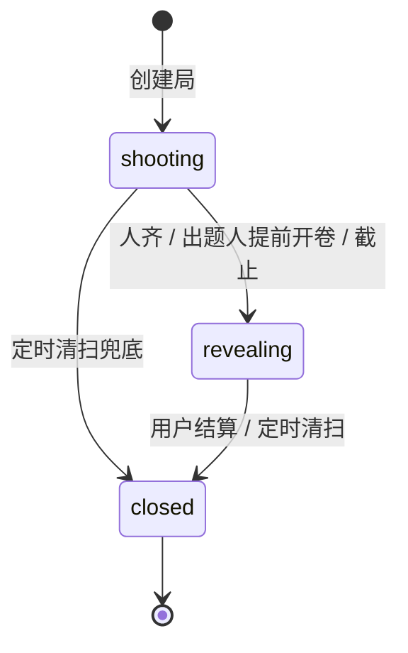

# 架构说明

## 1. 设计目标

「人间命题」面向小型熟人局，优先级依次为：

1. 微信群分享后能稳定加入和交卷。
2. 不依赖实时长连接，断网重试不产生重复数据。
3. 揭晓前严格匿名，结算后完整回填作者和卧底信息。
4. 云端 AI 不可用时，核心玩法仍能完成。
5. 前端可以在零云环境下完整演示和自动化测试。

## 2. 分层结构

```text
┌──────────────────────────────────────────────┐
│ pages / components                            │
│ 页面展示与交互，不包含云数据库访问            │
└──────────────────────┬───────────────────────┘
                       │
┌──────────────────────▼───────────────────────┐
│ src/api/index.js                              │
│ 统一方法、数据模型、错误语义、演示模式标识    │
└───────────────┬──────────────────┬───────────┘
                │                  │
┌───────────────▼────────┐  ┌──────▼─────────────────────┐
│ src/api/mock.js         │  │ src/api/cloud.js            │
│ storage + NPC 行为      │  │ 云函数调用 + 文件上传       │
└────────────────────────┘  └──────┬─────────────────────┘
                                    │ action / payload
                         ┌──────────▼─────────────────────┐
                         │ cloudfunctions/main/index.js   │
                         │ 鉴权与 action 路由              │
                         └──────────┬─────────────────────┘
                                    │
       ┌────────────────────────────┼────────────────────────────┐
       │                            │                            │
┌──────▼───────┐           ┌────────▼────────┐          ┌────────▼────────┐
│ game.js      │           │ ai.js           │          │ admin.js         │
│ 状态机/数据  │           │ 出题/裁判/点评  │          │ 题库种子         │
└──────┬───────┘           └────────┬────────┘          └─────────────────┘
       │                            │
┌──────▼────────────────────────────▼──────────────────────────────────────┐
│ 云数据库 / 云存储 / 微信内容安全 / 订阅消息 / OpenAI 兼容模型            │
└──────────────────────────────────────────────────────────────────────────┘
```

`cloudfunctions/timer` 不承载业务逻辑，只负责手动调用 `main` 的 `timer.sweep`。正式清扫由 `main/config.json` 的定时触发器每 5 分钟运行。

## 3. 回合状态机



约束：

- `shooting` 只允许局内玩家交卷，且每人的有效交卷只有一份。
- 只有局主可以提前开卷；通常还要求所有人已交卷。
- 进入 `revealing` 后发放匿名墙，允许猜人和三类投票。
- `closed` 由幂等结算写入，奖项、点评、出题权和明日预告只生成一次。
- 截止后仍处于 `shooting` 或 `revealing` 的局，会被定时任务推进到 `closed`。

## 4. 请求与业务流

### 创建和交卷

1. `round.create` 在云函数中生成局编号、命题、模式、截止时间和玩家列表。
2. 玩家分享后进入局内页；云函数确认调用者存在于 `players`。
3. 图片先上传云存储，`entry.submit` 只接收 `cloud://` fileID。
4. 云函数执行文本安全检查，并尽力调用视觉模型判断是否跑题。
5. 当前玩家标记已交卷；若人齐则进入 `revealing`，并按人数决定是否混入卧底。
6. 连击在交卷成功后更新，图片判定失败不会阻断交卷。

### 揭晓和投票

1. `wall.get` 只返回未判定为 `off` 的答卷，并随机打乱。
2. 返回项只含 `entryId / image / caption / isMine / 我的猜测 / 我的投票`，不含作者 openid，也不含卧底标记。
3. 猜人使用候选玩家列表；有卧底时增加 `__undercover__` 候选。
4. 投票标签固定为 `best / lazy / quote`。
5. 猜人与投票均以三元组唯一键幂等写入。

### 结算

1. `settleCore` 先检查 `rounds.result.settledAt`，已结算则直接返回。
2. 聚合三类票，卧底作品不参与评奖；并列时取更早交卷者。
3. 批量请求 AI 点评，失败时为每张作品选择稳定的兜底文案。
4. 更新获奖者统计；最绝奖同时获得一个 `power`。
5. 生成明日预告、发送订阅消息并写入 `rounds.result`。
6. 调用者视角再组装个人猜人成绩、我的战绩和奖项临时图片 URL。

## 5. 匿名与权限边界

- 前端页面从不查询云数据库，数据库集合建议保持“仅创建者可读写”，由云函数执行可信逻辑。
- `entries.openid` 和 `entries.undercover` 不进入揭晓墙 DTO。
- `getRound()` 只向当前用户返回自己的 `myEntry`，不返回其他玩家图片。
- 云函数从 `cloud.getWXContext().OPENID` 获取身份，不信任 payload 中的用户 ID。
- `admin.seedPrompts` 仅允许控制台无身份调用或 `ADMIN_OPENIDS` 中的管理员。
- `timer.sweep` 拒绝带用户身份的调用。
- API Key 只存在云函数环境变量中，不能进入 `src/`。

## 6. 幂等与一致性

| 操作 | 唯一键 / 屏障 | 重复调用行为 |
|---|---|---|
| 交卷 | `roundId + openid` 业务检查 | 返回“已经交过卷” |
| 猜人 | `roundId + voterOpenid + entryId` | 更新候选 |
| 投票 | `roundId + voterOpenid + entryId` | 更新标签 |
| 结算 | `rounds.result.settledAt` | 返回已有结果 |
| 局编号 | `counters/roundSeq` | 原子递增 |
| 卧底 | `rounds.undercover` | 已存在则跳过 |
| 出题权赠与 | `rounds.gift` | 已赠出则拒绝再次赠送 |

当前版本是面向小局的轻量实现：投票和玩家数组采用“先读后写”，已经通过唯一业务键和状态检查降低重复风险，但未使用数据库事务覆盖所有并发竞争。多人高并发场景需要进一步改为事务或独立关系集合。

## 7. 故障降级

| 故障 | 表现 | 降级策略 |
|---|---|---|
| AI Key 未配置 | 出题、裁判、点评不可用 | 官方题库、存疑放行、固定点评池 |
| AI 请求超时 | 交卷等待过长 | 20 秒后按存疑放行 |
| 图片下载失败 | 无法进行视觉判定 | 放行，记录日志 |
| 临时 URL 获取失败 | 图片链接可能不可用 | 保留原 fileID，由页面兜底 |
| 二维码生成失败 | 海报缺少真实小程序码 | 返回 `url: null`，使用假码演示 |
| 订阅消息失败 | 用户收不到提醒 | 捕获异常，不影响结算结果 |
| 定时器漏跑 | 过期局未及时关闭 | `timer` 云函数可手动补跑 |

## 8. 已知边界

- 页面轮询刷新局内状态，没有 WebSocket 实时推送。
- 玩家数组内嵌在 `rounds.players`，适合熟人小局，不适合大规模公开局。
- 图片机审目前以模型判定和文本安全检查为主，正式上线应接入 `security.mediaCheckAsync`。
- 结算后的统计更新是多次数据库写，不保证严格原子性。
- 明日预告从题库随机取一条，不是预先锁定下一次实际创建时使用的题。
